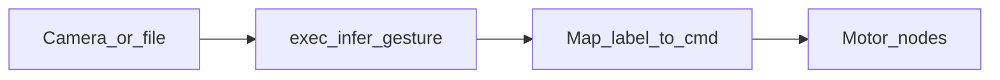

# 第6章 Node-RED とロボット制御

## この章の前に

[第5章 ロボット上の視覚推論（Jetson Nano）](05_robot_vision_inference.md) で **推論 JSON 契約** と CLI 単体テストを完了しておく。

## Node-RED の役割

**オーケストレーション** である。カメラ画像の保存 → `infer_gesture.py` 実行 → 結果 JSON のパース → **モータ・GPIO ノード** へメッセージ送信、という流れをフロー図でつなぐ。

深層学習そのものの学習ループはここでは扱わない（Colab 側の仕事）。

## ジェスチャ → 命令のマッピング（各自変更可）

**どのラベルがどの動きに対応するか** は、学生ごとに変えてよい。ただし **最大速度・緊急停止・異常時は停止** などの **安全限界** は教員指定の値を守る。

### マッピング設定（例：`gesture_map.json`）

```json
{
  "open_palm": {"action": "stop", "speed": 0},
  "fist": {"action": "forward", "speed": 0.3},
  "point": {"action": "spin_left", "speed": 0.4}
}
```

Node-RED では **function ノード** または **file ノードで読み込んだ JSON を保持する inject** で、この表を参照し、`msg.payload` を Mouse 付属のトピック形式に変換する。 **1か所に集約** しておくと、デバッグしやすい。

### 推論出力との接続

第5章のレスポンスの `label` をキーに `gesture_map.json` を引く。`label` が未定義のときは **必ず停止** など安全側に倒す。

## フロー全体（概念）



## 安全に関する注意

- バッテリ・配線・可動域を **Mouse のマニュアル** に従う。
- フローをいじるときは **足を浮かせた状態** で最初に動作確認する。
- `infer_gesture.py` が `ok:false` のときは **命令を出さない**。

## 実機がない場合

- PC 上で `infer_gesture.py` の JSON 出力を **inject ノードで模倣** し、マッピング以降のフローだけを検証する。
- または教員提供の **録画デモ** を参照し、同じ JSON が流れたときのフロー図を紙に書く。

## 演習（第6章メイン）

- **目的**：自分の `gesture_map.json` を定義し、少なくとも **2ラベルで異なる命令** が出ることを確認する。
- **環境**：Jetson Nano Mouse 上の Node-RED（または PC で inject のみ）。
- **所要時間**：45–90 分。
- **成功の見え方**：実機または inject のいずれかで、ラベル変更に応じて出力ペイロードが切り替わる。安全限界を超える速度が設定できないようになっている（教員ルールに従う）。

## 用語メモ

| 口語 | 用語 |
|------|------|
| 配線図みたいな IDE | Node-RED フロー |
| メッセージ | `msg` オブジェクト（`payload` 等） |
